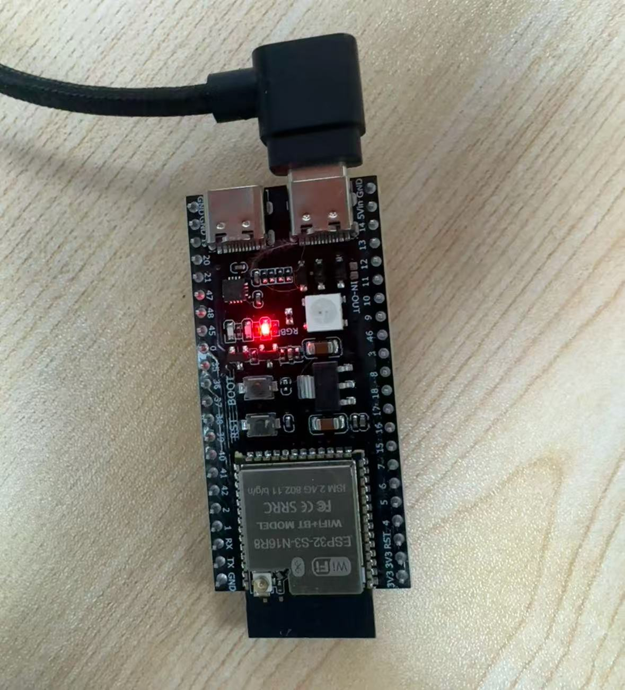
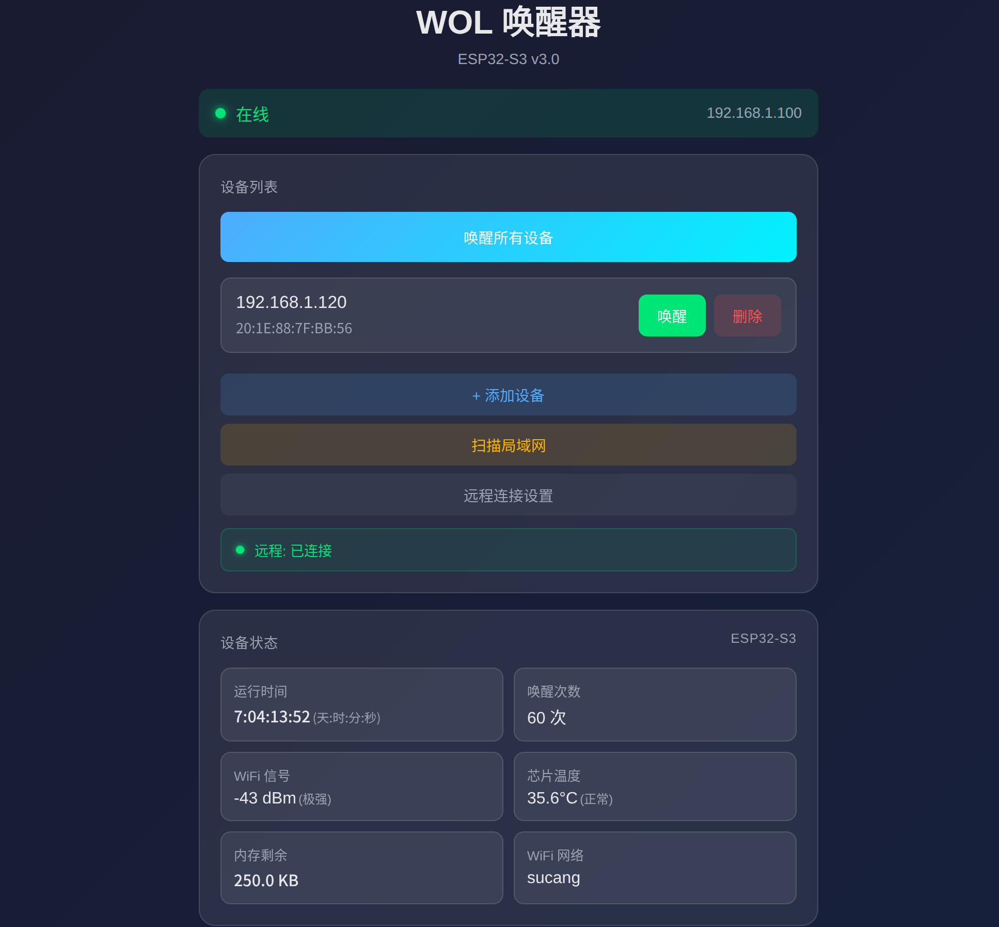

# ESP32 WOL Remote Wake-on-LAN

[中文文档](README_CN.md)

A Wake-on-LAN remote wake-up system based on ESP32-S3, supporting remote control of LAN devices through a public server.



## Features

- **Remote Wake** - Wake LAN devices from outside via WebSocket connection to a public server
- **Device Management** - Add, delete, and wake saved devices
- **LAN Scanning** - Multi-round ARP scanning with mDNS hostname resolution
- **Broadcast Wake** - One-click broadcast WOL packet to the entire LAN
- **Status Monitoring** - Real-time uptime, wake count, temperature, WiFi signal, memory usage
- **BLE Anti-Sleep** - Periodic Bluetooth key presses to prevent PC from sleeping
- **Dual Interface** - ESP32 local Web UI + Go server remote UI
- **Dark/Light Theme** - Theme switching with preference persistence
- **OAuth Login** - WeChat OAuth support
- **Flexible Config** - CLI flags, environment variables, or .env file

## System Architecture

```
┌─────────────┐     WebSocket      ┌─────────────┐
│   ESP32-S3  │◄──────────────────►│  Go Server  │
│    (LAN)    │                    │  (Public)   │
└─────────────┘                    └─────────────┘
       │                                  │
       │ WOL Magic Packet                 │ Web UI
       ▼                                  ▼
┌─────────────┐                    ┌─────────────┐
│  LAN Device │                    │   Browser   │
└─────────────┘                    └─────────────┘
```

## Screenshots



## Hardware Requirements

- ESP32-S3-DevKitC-1 development board
- Optional: Button (connected to BOOT pin for physical wake trigger)

## Project Structure

```
esp32-wol/
├── src/
│   ├── main.cpp          # Main program
│   ├── config.h          # Configuration
│   ├── ble_keyboard.h    # BLE anti-sleep keyboard
│   └── web_server.h      # Web UI HTML
├── server/
│   ├── main.go           # Go WebSocket server
│   ├── templates/
│   │   └── index.html    # Remote Web UI
│   ├── deploy.sh         # Deploy script
│   ├── .env.example      # Environment variable template
│   ├── go.mod
│   └── go.sum
├── docs/                 # Images and documentation
├── platformio.ini        # PlatformIO config
└── README.md
```

## Quick Start

### 1. Configure ESP32

Edit `src/config.h` with your WiFi and auth credentials:

```cpp
const char* WIFI_SSID = "your-wifi-ssid";
const char* WIFI_PASSWORD = "your-wifi-password";
const char* AUTH_USERNAME = "admin";
const char* AUTH_PASSWORD = "your-password";
```

Set the WebSocket token (must match the server):

```cpp
String WS_TOKEN = "your-secret-token";
```

### 2. Build & Flash ESP32

```bash
# Build
pio run

# Flash (with ESP32 connected)
pio run -t upload

# Serial monitor
pio device monitor
```

### 3. Configure Go Server

Copy the example env file:

```bash
cd server
cp .env.example .env
```

Edit `.env` with your settings:

```bash
# Server listen port
WOL_PORT=8199

# Admin password (required)
WOL_PASSWORD=your_secure_password

# WebSocket token for ESP32 connection (required)
WOL_TOKEN=your_secret_token

# OAuth config (optional)
WOL_OAUTH_APP_ID=
WOL_OAUTH_APP_SECRET=
WOL_OAUTH_USER_ID=
```

### 4. Deploy Go Server

```bash
cd server

# Basic (IP only, uses .env config)
./deploy.sh your-server-ip

# Full parameters
./deploy.sh <server-ip> [user] [port] [password]

# Examples
./deploy.sh 1.2.3.4
./deploy.sh 1.2.3.4 root 8199 your_password
```

### 5. Connect ESP32 to Remote Server

Open the ESP32 Web UI (check serial output for IP), then in Settings:
- Enable remote connection
- Set WebSocket server address: `ws://your-server:8199/ws`
- Set Token (must match server)

## Server Configuration

The Go server supports three configuration methods (highest to lowest priority):

| Priority | Method | Example |
|----------|--------|---------|
| 1 | CLI flags | `-port 8199 -password xxx` |
| 2 | Environment variables | `WOL_PORT=8199` |
| 3 | .env file | `WOL_PORT=8199` |
| 4 | Default | `8080` |

### Environment Variables

| Variable | Description | Required |
|----------|-------------|----------|
| `WOL_PORT` | Listen port (default `8080`) | No |
| `WOL_PASSWORD` | Admin password | **Yes** |
| `WOL_TOKEN` | WebSocket token | **Yes** |
| `WOL_OAUTH_APP_ID` | OAuth app ID | No |
| `WOL_OAUTH_APP_SECRET` | OAuth app secret | No |
| `WOL_OAUTH_USER_ID` | OAuth allowed user ID | No |

### CLI Flags

```bash
./wol-server -port 8199 \
  -password "your_password" \
  -token "your_token" \
  -app-id "100003" \
  -app-secret "your_secret" \
  -user-id "your_user_id"
```

## API Reference

### ESP32 HTTP API

| Endpoint | Method | Description |
|----------|--------|-------------|
| `/` | GET | Web UI |
| `/wake?index=N` | GET | Wake device by index |
| `/wake?all=1` | GET | Wake all saved devices |
| `/wake/broadcast` | GET | Broadcast wake to entire LAN |
| `/add?name=&mac=` | GET | Add device |
| `/delete?index=N` | GET | Delete device |
| `/list` | GET | Get device list |
| `/scan` | GET | Start LAN scan |
| `/scan/results` | GET | Get scan results |
| `/status` | GET | Get system status |
| `/settings` | GET | Get remote connection settings |
| `/settings/save` | GET | Save remote connection settings |

### WebSocket Commands

| Command | Description |
|---------|-------------|
| `get_devices` | Get device list |
| `wake` | Wake device |
| `wake_broadcast` | Broadcast wake |
| `add_device` | Add device |
| `delete_device` | Delete device |
| `scan` | Start scan |
| `get_scan_status` | Get scan status |
| `get_status` | Get status |

## Tech Stack

- **ESP32 Firmware**
  - Arduino Framework
  - HijelHID_BLEKeyboard (NimBLE)
  - ArduinoWebsockets
  - ArduinoJson 7.x
  - ESP32Ping
  - ESPmDNS

- **Go Server**
  - gorilla/websocket
  - golang-jwt/jwt
  - godotenv

## License

MIT License
